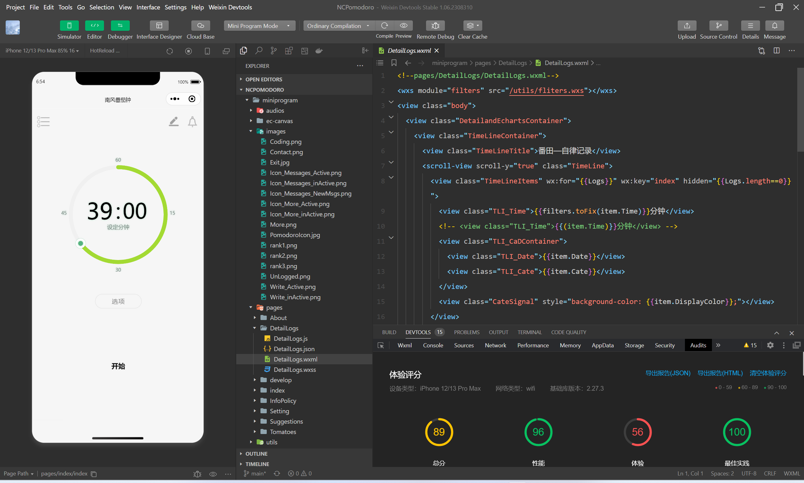
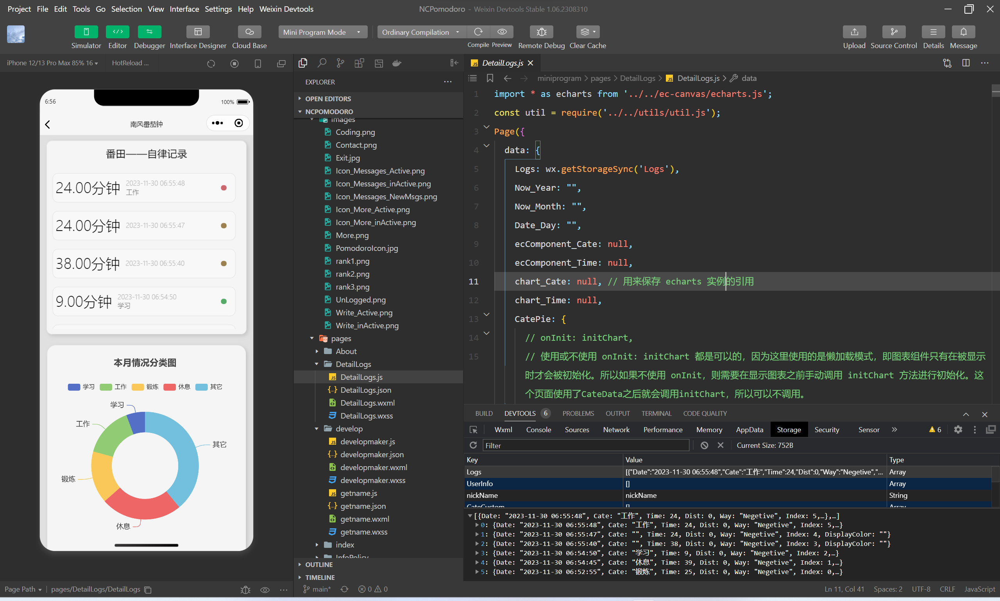
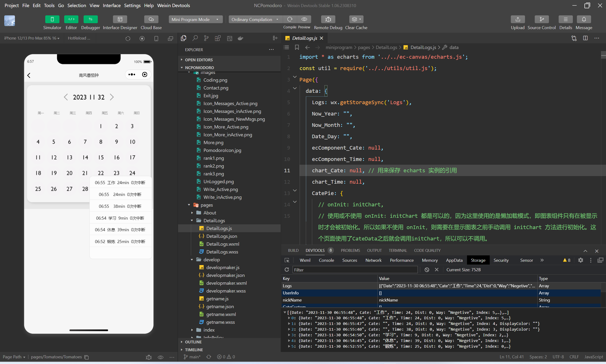
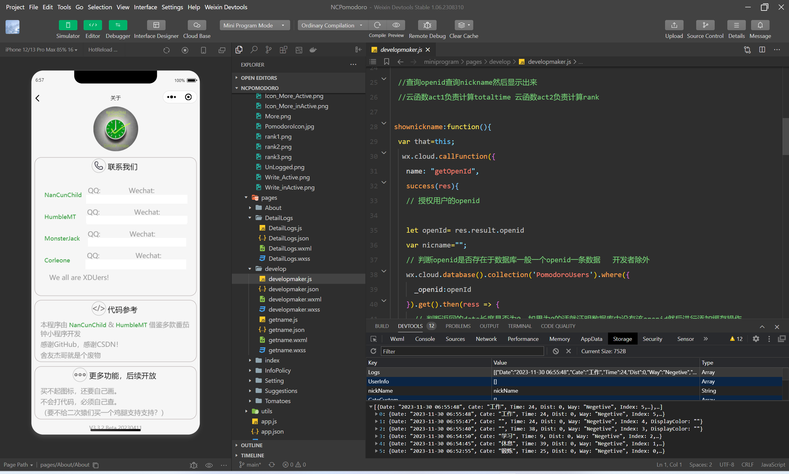

# Appearence
    below are appearence of this miniprogram:

---
# Contributions
## The most difficult part of this project is dynamic echarts
- Really? There are tons of document of echarts on the website.

- Yes. But echarts always be used in HTML,rather than WeChat miniprograms.Though it can also be used in wechat,less directions We can find.

## Yuhan Tang also a great contributer of this program.
- NanCunChild put the main effort on echarts,CSS,Javascript. Meanwhile Tang made use of cloud functions to make cloud storge possible.
Thus coperation made our NCPomodoro a better miniprogram!

## Ziyang Lin does less on programming. But PowerPoint is as important as programming itself.
Yes. Promotion relies heavyly on presentation.

### Developer List:
* Yuhang Liu(NanCunChild) 
* Ziyang Lin(Elon) 
* Yuhan Tang(HumbleMT)

### Project Outside Helper:
* Tangong Li

### Experients:
* Junze Yu
* Jie Zhang

---
When I look back on this program, I have to say that it is no feature but using no components to make a modern appearence.

It is a little hard, and I still remember the determination when I dev it. Thanks for everyone who devoded on it!

---